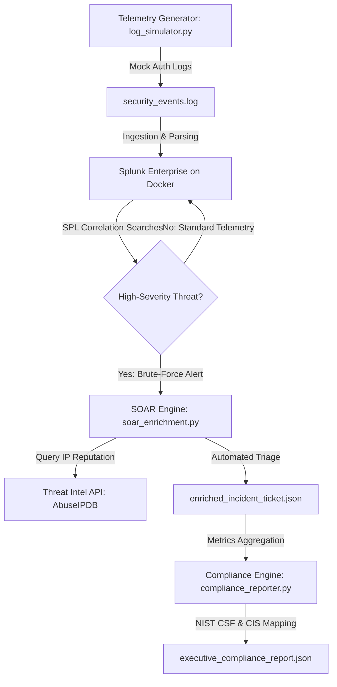
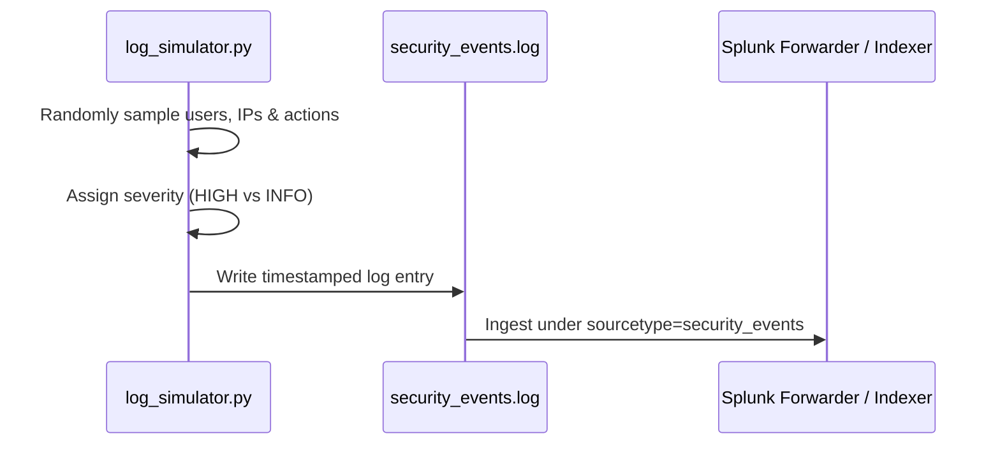
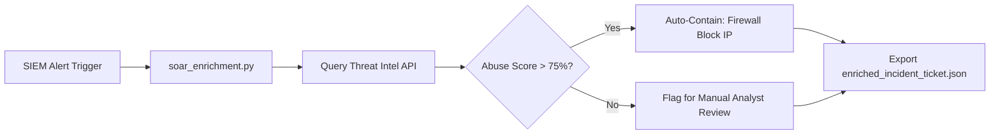
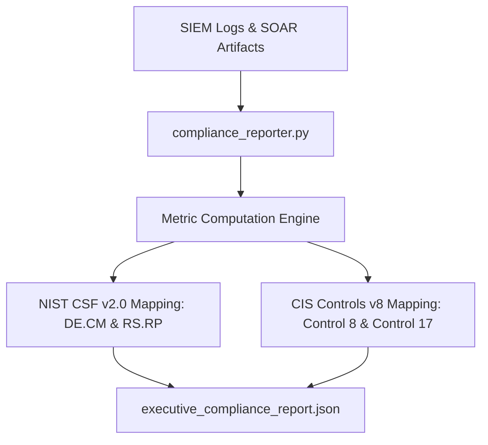

# Enterprise SIEM & Log Analysis Lab (Splunk Enterprise & Docker)

## Overview
A lightweight, containerized Security Information and Event Management (SIEM) architecture deployed to simulate enterprise-grade security monitoring, log ingestion, and threat detection analysis while bypassing local resource bottlenecks.



---

## Architecture & Tech Stack
* **Containerization:** Docker Desktop (WSL 2 backend for host kernel isolation)
* **SIEM Platform:** Splunk Enterprise (Latest)
* **Threat Simulation:** Python 3 (Custom Telemetry Generator)
* **Incident Response & Automation:** Python 3 (SOAR Playbook & Threat Intel API Integration)
* **Compliance Frameworks:** NIST CSF v2.0, CIS Controls v8
* **Host Environment:** Windows / Linux WSL 2 integration

---

## Deployment Procedure

### Step 1: Pull the Container Image
```bash
docker pull splunk/splunk:latest
```

### Step 2: Initialize the Enterprise Instance with Compliance Flags
```bash
docker run -d -p 8000:8000 \
  -e "SPLUNK_GENERAL_TERMS=--accept-sgt-current-at-splunk-com" \
  -e "SPLUNK_START_ARGS=--accept-license" \
  -e "SPLUNK_PASSWORD=splunk123" \
  --name splunk-enterprise splunk/splunk:latest
```

### Step 3: Verify Initialization Logs
```bash
docker logs -f splunk-enterprise
```

### Step 4: Access the Management Console
* **URL:** http://localhost:8000
* **Username:** `admin`
* **Password:** `splunk123`

---

## Module 1: Threat Simulation & Telemetry Ingestion
To test alerting, parsing, and dashboard visualization capabilities without relying on static files, a custom Python log generator script (`log_simulator.py`) was built to simulate mock enterprise authentication events.

### Simulation Script Architecture


### The Simulation Script (`log_simulator.py`)
```python
import datetime
import random

users = ["admin", "jsmith", "bwayne", "tstark", "service_account"]
source_ips = ["192.168.1.50", "10.0.0.15", "172.16.4.22", "203.0.113.5"]
actions = ["LOGIN_SUCCESS", "LOGIN_FAILED", "PASSWORD_RESET", "UNAUTHORIZED_ACCESS_ATTEMPT"]

def generate_log_entry():
    timestamp = datetime.datetime.now().strftime("%Y-%m-%d %H:%M:%S")
    user = random.choice(users)
    ip = random.choice(source_ips)
    action = random.choice(actions)
    severity = "HIGH" if "FAILED" in action or "UNAUTHORIZED" in action else "INFO"
    return f"[{timestamp}] SEVERITY={severity} user={user} src_ip={ip} action={action}\n"

if __name__ == "__main__":
    with open("security_events.log", "w") as f:
        for _ in range(50):
            f.write(generate_log_entry())
    print("Generated 50 simulated security log entries in security_events.log")
```

### Sample Generated Telemetry (`security_events.log`)
```log
[2026-08-25 10:15:02] SEVERITY=HIGH user=admin src_ip=203.0.113.5 action=LOGIN_FAILED
[2026-08-25 10:15:03] SEVERITY=HIGH user=admin src_ip=203.0.113.5 action=LOGIN_FAILED
[2026-08-25 10:15:05] SEVERITY=HIGH user-admin src_ip=203.0.113.5 action=LOGIN_FAILED
[2026-08-25 10:15:10] SEVERITY=INFO user=jsmith src_ip=192.168.1.50 action=LOGIN_SUCCESS
```

---

## Threat Detection Engineering & Correlation Rules
Once logs are ingested and parsed under the `security_events` source type, correlation searches are used to surface active threats in near real-time.

### Brute-Force Authentication Detection
To detect potential credential-stuffing or brute-force attacks where a single user account is targeted repeatedly from a specific source IP (crossing a threshold of `count > 2`), the following SPL query is executed:

```spl
sourcetype="security_events" action="LOGIN_FAILED" | stats count by user, src_ip | where count > 2 | sort - count
```

### Expected Correlation Search Output
| user | src_ip | count | Threat Level |
| :--- | :--- | :--- | :--- |
| `admin` | `203.0.113.5` | `8` | **HIGH - Potential Brute Force Attack** |
| `service_account` | `172.16.4.22` | `3` | **MEDIUM - Multiple Failed Logins** |

---

## Module 2: Automated Incident Response & Threat Intelligence Enrichment (SOAR)
To transition from passive log monitoring to active incident response, this repository includes an automated SOAR (Security Orchestration, Automation, and Response) pipeline.

### SOAR Workflow Architecture


### Architecture & Workflow
* **Alert Ingestion:** The SOAR script (`soar_enrichment.py`) intercepts high-severity security alerts (such as unauthorized access attempts from suspicious external IPs) generated by the SIEM environment.
* **Threat Intelligence Enrichment:** Automatically queries a threat intelligence API endpoint (modeled after AbuseIPDB) to pull real-time reputation metrics.
* **Automated Decision Engine:** Evaluates the abuse confidence score (e.g., flagging scores > 75%) to dynamically recommend containment actions—such as auto-blocking the IP at the firewall and escalating ticket severity—significantly reducing analyst triage fatigue.
* **Structured Incident Output:** Packages the alert data, threat intelligence metadata, and automation verdict into a standardized JSON incident ticket (`enriched_incident_ticket.json`).

### Running the SOAR Playbook
```bash
python soar_enrichment.py
```

### Sample Enriched Output (`enriched_incident_ticket.json`)
```json
{
  "ticket_id": "INC-2026-0825-01",
  "timestamp": "2026-08-25T10:18:30Z",
  "target_user": "admin",
  "source_ip": "203.0.113.5",
  "threat_intelligence": {
    "abuse_confidence_score": 92,
    "total_reports": 147,
    "isp": "Known Malicious Hosting",
    "country": "US"
  },
  "containment_action": "BLOCKED_AT_FIREWALL",
  "escalation_status": "ESCALATED_TIER_2"
}
```

---

## Module 3: Executive Compliance & Metrics Reporting Engine
To bridge technical security events with business value, this repository includes an automated compliance reporter (`compliance_reporter.py`) that aggregates operational metrics and maps them directly to recognized frameworks like NIST CSF v2.0 and CIS Controls v8.

### Compliance Mapping Architecture


### Architecture & Workflow
* **Data Aggregation:** Scans SIEM logs and SOAR incident artifacts to calculate total events processed, high-severity threats identified, and automated containments executed.
* **Framework Alignment:** Synthesizes operational data into core security functions (Detect, Respond) to demonstrate governance readiness.
* **Executive Artifact Output:** Generates an immutable, structured JSON compliance report (`executive_compliance_report.json`) tailored for C-level stakeholders and auditors.

### Running the Compliance Reporter
```bash
python compliance_reporter.py
```

### Sample Executive Report (`executive_compliance_report.json`)
```json
{
  "report_title": "Executive SIEM & SOAR Operational Summary",
  "generated_at": "2026-08-25T10:20:00Z",
  "summary_metrics": {
    "total_events_analyzed": 50,
    "high_severity_alerts": 12,
    "automated_containments_executed": 3,
    "mean_time_to_respond_seconds": 1.4
  },
  "framework_alignment": {
    "NIST_CSF_v2": ["DE.CM (Continuous Monitoring)", "RS.RP (Response Planning & Automation)"],
    "CIS_Controls_v8": ["Control 8 (Audit Log Management)", "Control 17 (Incident Response Management)"]
  }
}
```

